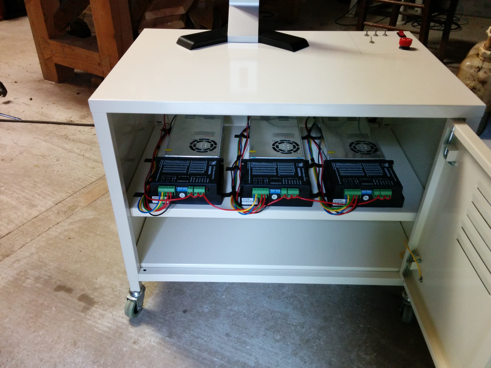
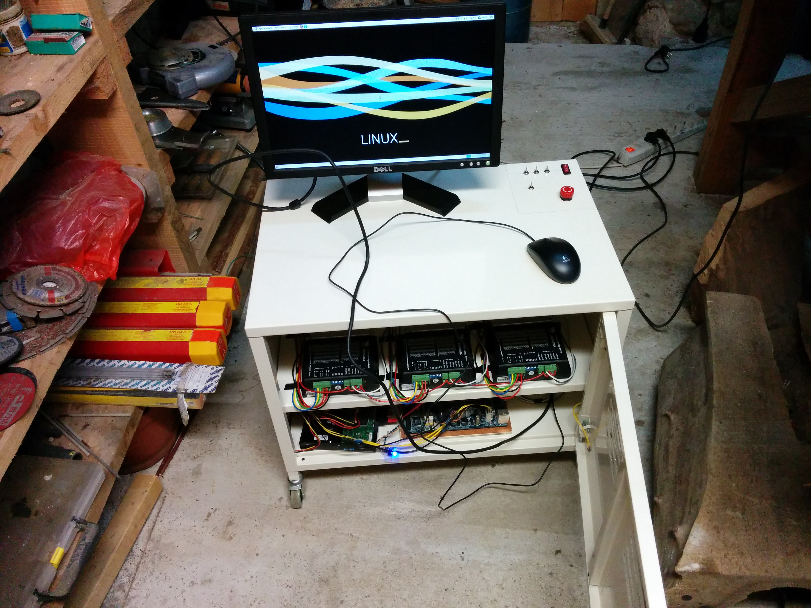
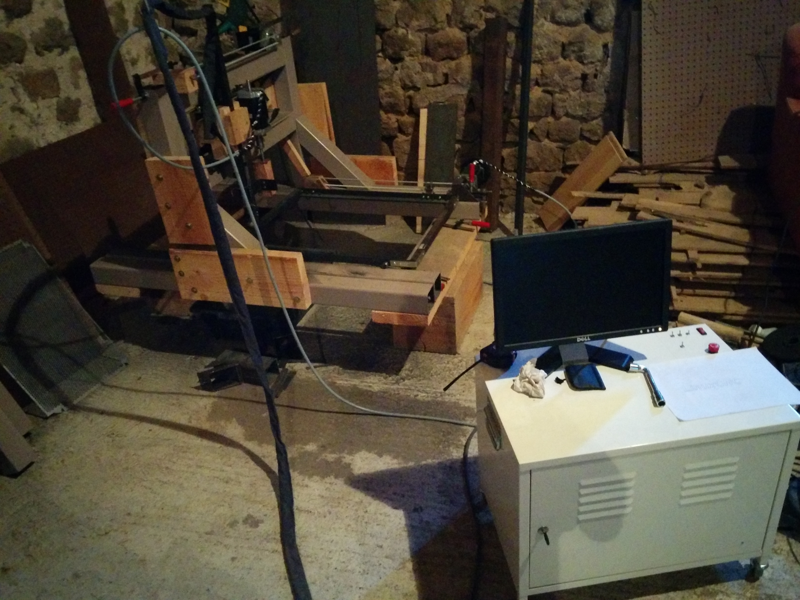
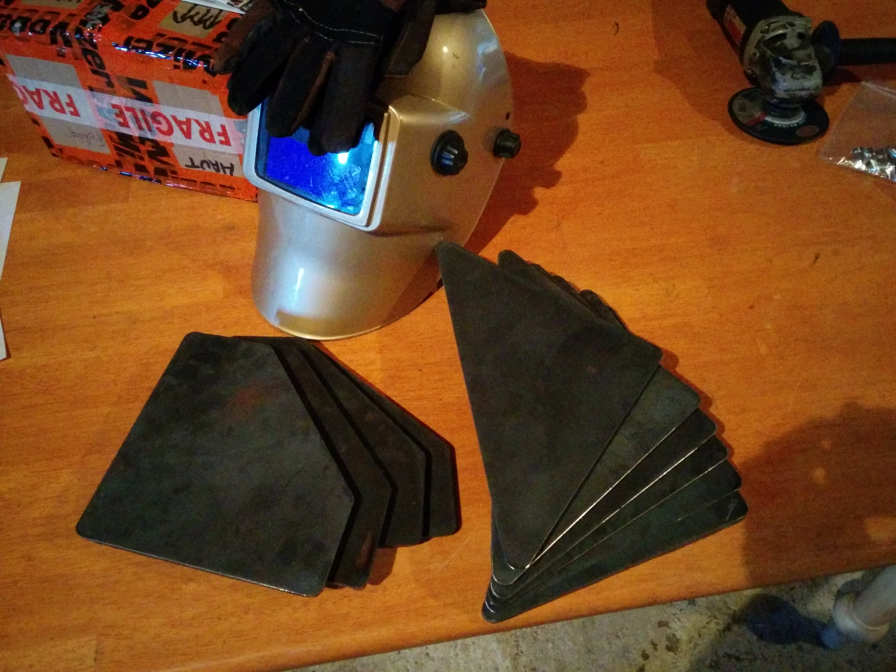
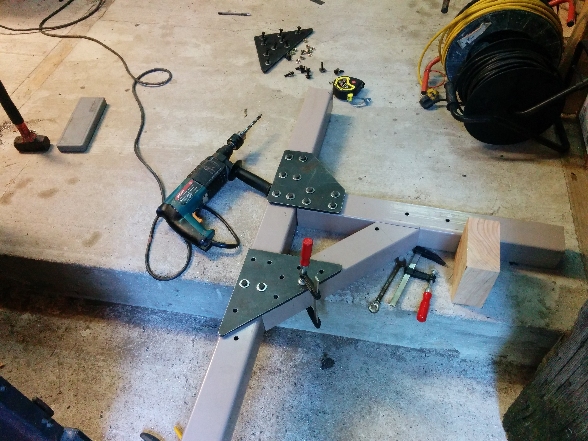
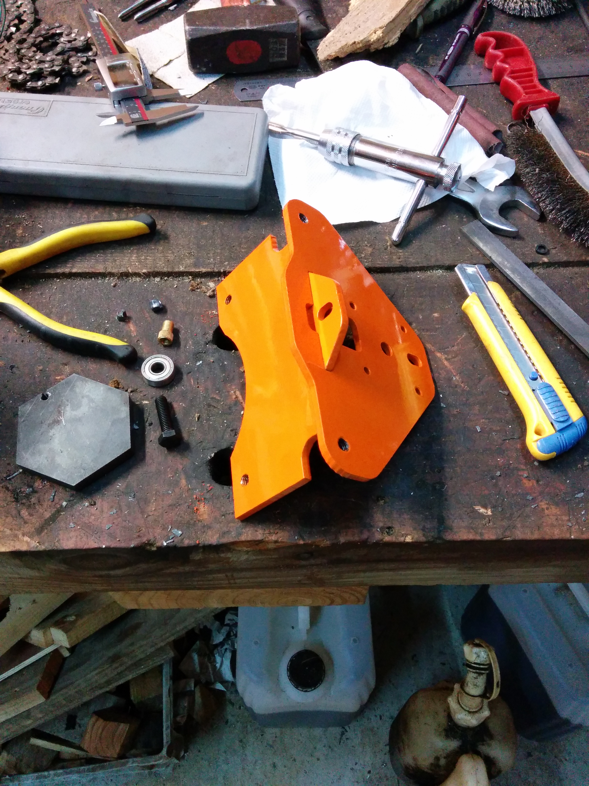
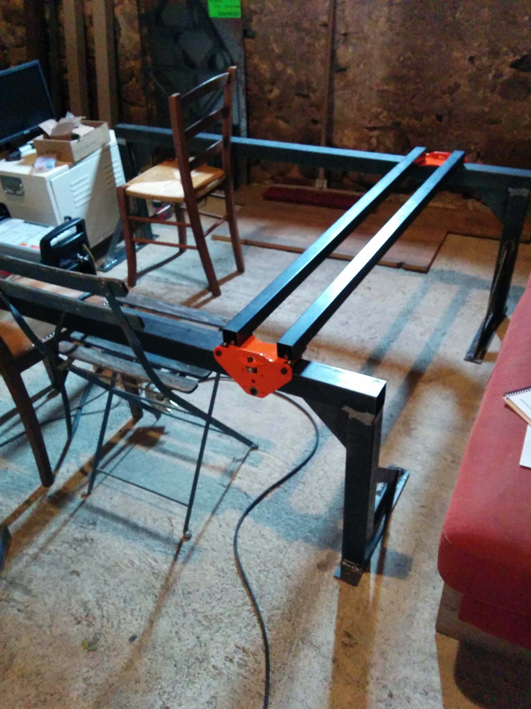
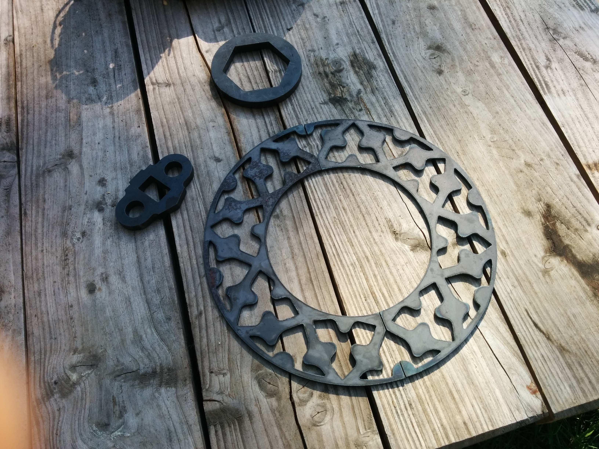

# DIY CNC plasma cutting machine

## Context

A few years ago, I started working on a miling machine. Along the way, I turned it into a plasma cutter in order to leave the machine create its own pieces.
Finally, the needs I had for a milling machine changed and the plasma better fulfilled my goals.

Today, the first version based on the milling machine frame is functionnal but is not well suited for what it does. I have to evolve it into a real plasma router, larger, more lightweigth and with a cutting tool doing all the moves itself (it's hard to move a 3 meters long steel sheet).

## Plasmarlin

On the otherside, I'm developing software to replace and simplify the control part.
Currently it uses a computer running LinuxCNC (real time kernel) and every communication with the machine is handled by the serial port to satisfy real-time constraints. This being said, it is not user friendly at all, especially for other people than me without computer science degree. It is also a real pain to add new sensors like one for the plasma arc voltage and commercial self-standing solutions are ridiculously expensive for what it does.

In the same time I've seen 3D printing make a lot of progress with hardware costing no more than tens of euros.
That's why I started Plasmarlin, a fork from Marlin which is one of the most used 3D printer software.
It is initially based on Atmega chips, meaning that all the software could run on an inexpensive board instead of a desktop computer, while simplifying many other aspects.

## Test Bench
The first thing I've did when starting Plasmarlin developement was to create a hardware test bench emulating all the different elements of the machine.

It is composed of the main board itself, but also of a second Arduino Mega to play test scenarios and a Saleae oscilloscope to acquire every "answer" from the main board.
I'm now able to run non-regression tests easily.

## Hardware (frame 1.0)
### Electrical cabinet
These are the stepper motor drivers with their respective power supply. As it was first intended to be a milling machine, the motors and their power electronics are pretty strong.
The control computer is visibe is the second picture.

### Frame 1.0
The first frame and its temporary wooden pieces before being replaced by plasma cut ones.

The steel replacement parts.

### Frame 2.0
Having a functionnal plasma cutter while building the new frame allows for these industrial looking parts.

The future frame is taking shape.

### Example cuts

